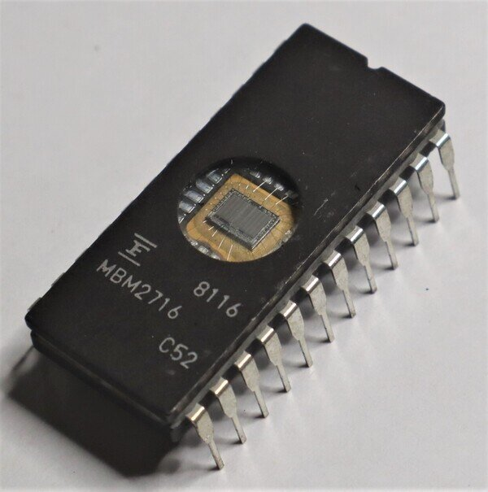
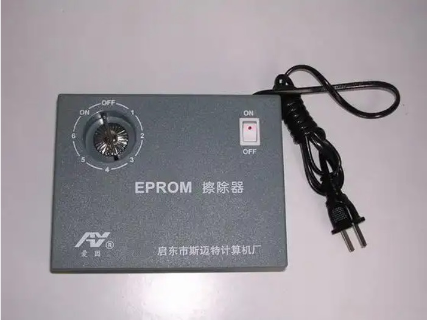
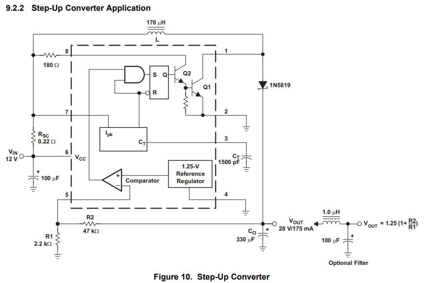
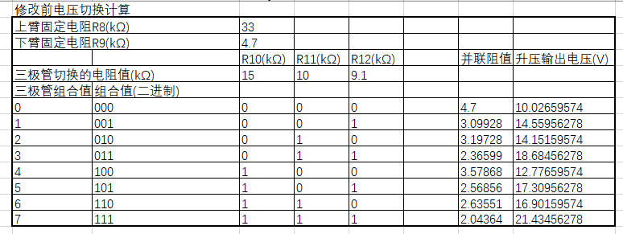
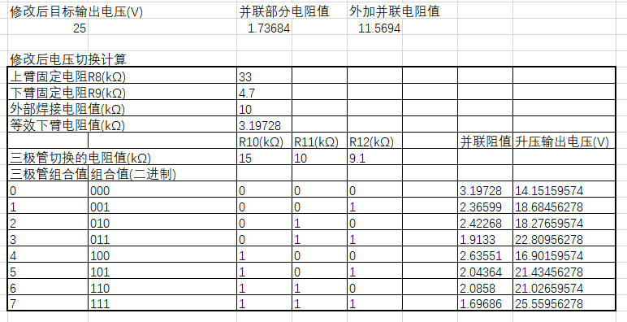
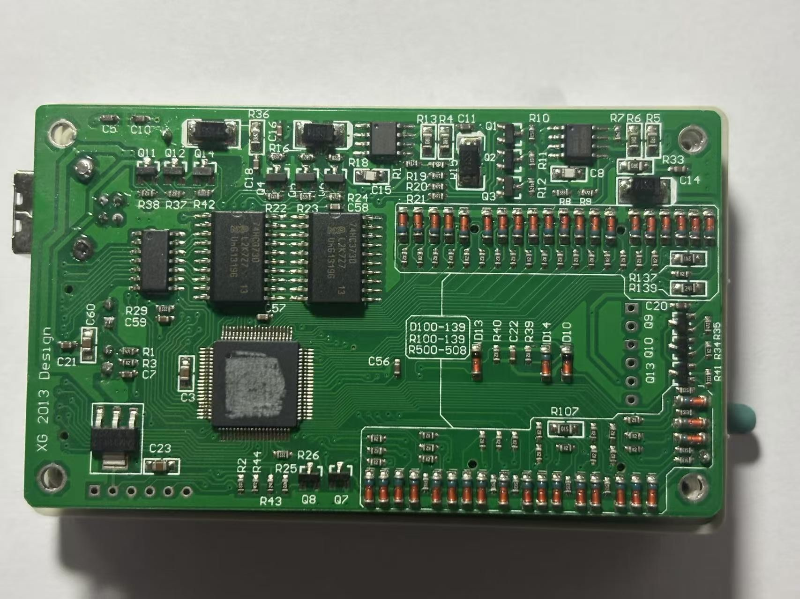
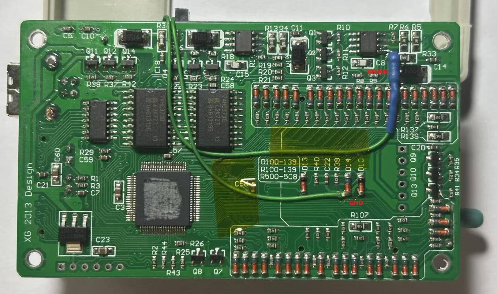
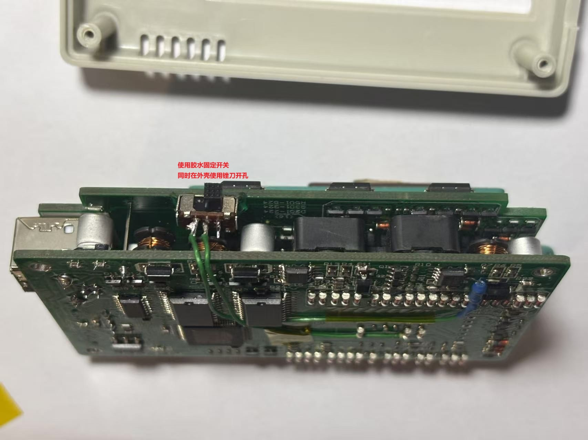
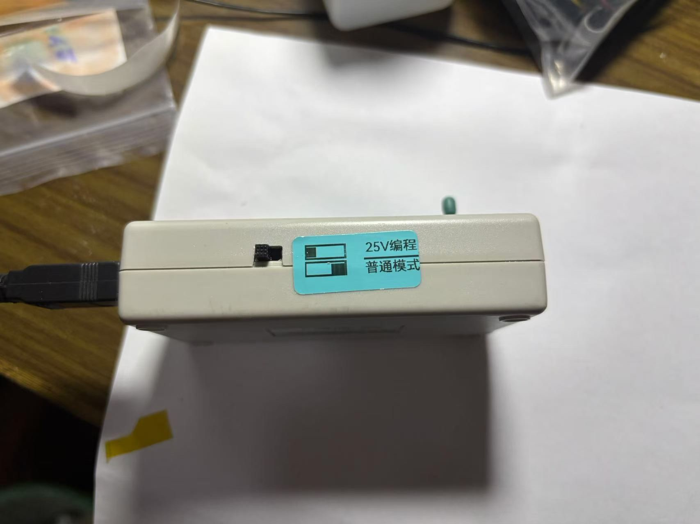

### 使用TL866CS的烧写2716的电压改造 ###

#### 背景介绍

2716 是在七八十年代的古董 8 位计算机常见的 ROM 芯片，一般用来存储系统的代码，在游戏机和卡带中十分常见，其外观如下：

和常见的很多ROM芯片一样，其需要通过擦除才可以写入新的数据，擦除是通过使用波长 253.7nm 的紫外线 C 波段来照射，同时要求的照射剂量为 15 瓦秒/立方厘米。芯片的透明窗体距离光源的距离为 2.54cm 左右。照射的时间长短和距离的长短的平方成正比。擦除器可以和我一样购买成品，也可以使用普通的消毒专用的紫外线灯光替代，但是貌似用于UV胶水固化的光源是不可以用于紫外线擦除的。在使用紫外线时注意防护，避免对皮肤和眼睛的伤害。专用的紫外擦除器如下图，其中带有一个机械定时结构：

在使用 EPROM 擦除器将芯片内部的全部擦除为空 (0xFF) 之后, 就可以通过编程器对芯片进行编程，在现在这个时间点建议使用 XGecu T48 通用编程器（TL866三代）编程器，价格大概在300元左右。但是当初我为了省钱买了一个 XGecu TL866CS 二代，当然也是因为这个原因才有了下面的文章。不过对于开始折腾古董硬件的人来说，我现在的建议不要购买太古老的编程器，因为古老的编程器有的是并口的，有的对新的windows操作系统不兼容。

#### 原理分析

我购买的编程器是 xgecu 公司的 t48 编程器的上一版本 TL866CS，问题是这个版本的硬件上有限制，最高编程电压只能到 21V，但是我手头的 2716 芯片需要的编程电压是 25V，因此会导致编程失败，其实这个问题老外早就发现已经有了很多解决办法，其中一个比较常见的解决办法就是做一个电压转换切换电路，通过MOS 管切换外部的 25V 来达到编程的目的，咸鱼上也有转换电路板售卖，但是这种做法比较麻烦，同时费用比较高，不符合我的极简主义观点。

[老外制作的电压转换板]([TL866 Programmer Adapter](https://www.theoddys.com/acorn/development_tools/tl866/tl866_adapter.html))

偶然间在 EEVblog 上发现一个老外通过改造内部升压 IC 反馈电阻来实现将电压修改到25V的目的，这个改造虽有是有损的，但是成本低更加方便，于是我抱着尝试的心态做了测试和原理分析，想在将其过程做简单分享。

[原文链接](https://www.eevblog.com/forum/testgear/modification-to-add-the-missing-21-and-25-volt-vpp-ranges-to-your-tl866ii-plus/)

通过原理图不难发现，其VPP编程电压是通过MC34063产生的，MC34063的升压输出电压的基本原理框图如下：

不同的编程电压是通过最左边的三组三极管开关切换来产生的，从TL866的软件选择不同的电压值，就是通过GPIO控制不同的三级管导通，使得不同的反馈电阻接入反馈电阻网络。为了方便分析便制作了一个表格验证猜想。

#### 修改思路

显然通过计算其输出电压值中和实际软件中设置的数字是一致的，因此根据MC34063的输出电压计算公式,想要VPP的电压升高为25V，只需要在R9两端并联一个电阻，至于并联的电阻值可以通过excel计算出来。

计算出来的电阻值为 11.5K，但是这不是一个标准电阻值，因此选择接近的10K作为实际改造使用的电阻值，将10K的电阻并联之后的电阻值带入计算就可以得到新的电压输出值，实际在改造时将一个 10K 的电阻一端和R9的上端向连，电阻的另外一端和一个开关相连，开关控制电阻和GND的连接与断开，这样当开关断开新添电阻和GND的连接之时，烧写器工作在原本的模式，当开关将新添电阻和GND相连，编程器工作在25V烧写模式。

#### 修改实践

拆出来的没有修改的电路板如下：

电路修改如下：

开关固定

外壳开孔和贴标签

完成改造，实际测试通过，如果感兴趣的朋友也可以尝试模仿。但是因为是有损改造，请在理解其原理之后进行，使用测试用的2716芯片进行测试，避免丢失或者损坏唯一的rom数据。
